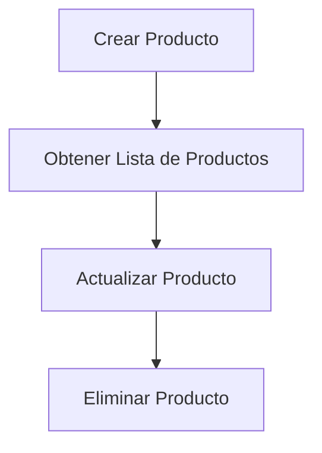
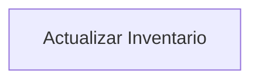
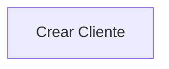
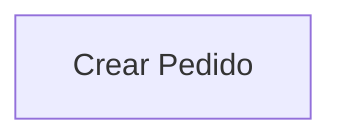
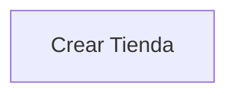

# Información del Frontend

# Información del Backend

## Ejecutar la app

```bash
npm install --force
npm install -g @nestjs/cli
npm init
npm start
# (Se ejecuta en http://localhost:3000/api/)
```

## Documentación de la API REST

## Endpoints

### Productos

#### Crear un Producto

- **URL**: `/api/products`
- **Método**: `POST`
- **Descripción**: Crea un nuevo producto.
- **Request Body**:

```json
{
  "name": "Nombre del Producto",
  "description": "Descripción del Producto",
  "price": 100.0,
  "stock": 50,
  "category": "Categoría del Producto"
}
```

- **Response**:

```json
{
  "id": 1,
  "name": "Nombre del Producto",
  "description": "Descripción del Producto",
  "price": 100.0,
  "stock": 50,
  "category": "Categoría del Producto",
  "createdAt": "2024-06-01T00:00:00Z"
}
```

#### Obtener Lista de Productos

- **URL**: `/api/products`
- **Método**: `GET`
- **Descripción**: Obtiene una lista de todos los productos.
- **Response**:

```json
[
	{
		"id": 1,
		"name": "Nombre del Producto",
		"description": "Descripción del Producto",
		"price": 100.00,
		"stock": 50,
		"category": "Categoría del Producto",
		"createdAt": "2024-06-01T00:00:00Z"
	},
	...
]
```

#### Actualizar un Producto

- **URL**: `/api/products/{id}`
- **Método**: `PUT`
- **Descripción**: Actualiza la información de un producto existente.
- **Request Body**:

```json
{
  "name": "Nombre del Producto Actualizado",
  "description": "Descripción del Producto Actualizada",
  "price": 120.0,
  "stock": 60,
  "category": "Nueva Categoría"
}
```

- **Response**:

```json
{
  "id": 1,
  "name": "Nombre del Producto Actualizado",
  "description": "Descripción del Producto Actualizada",
  "price": 120.0,
  "stock": 60,
  "category": "Nueva Categoría",
  "updatedAt": "2024-06-01T01:00:00Z"
}
```

#### Eliminar un Producto

- **URL**: `/api/products/{id}`
- **Método**: `DELETE`
- **Descripción**: Elimina un producto existente.
- **Response**:

```json
{
  "message": "Producto eliminado exitosamente."
}
```

### Inventario

#### Actualizar Inventario

- **URL**: `/api/inventory`
- **Método**: `PUT`
- **Descripción**: Actualiza la cantidad de inventario de un producto.
- **Request Body**:

```json
{
  "productId": 1,
  "quantity": 100
}
```

- **Response**:

```json
{
  "productId": 1,
  "quantity": 100,
  "updatedAt": "2024-06-01T01:30:00Z"
}
```

### Clientes

#### Crear un Cliente

- **URL**: `/api/customers`
- **Método**: `POST`
- **Descripción**: Crea un nuevo cliente.
- **Request Body**:

```json
{
  "name": "Nombre del Cliente",
  "email": "cliente@example.com",
  "address": "Dirección del Cliente"
}
```

- **Response**:

```json
{
  "id": 1,
  "name": "Nombre del Cliente",
  "email": "cliente@example.com",
  "address": "Dirección del Cliente",
  "createdAt": "2024-06-01T02:00:00Z"
}
```

### Pedidos

#### Crear un Pedido

- **URL**: `/api/orders`
- **Método**: `POST`
- **Descripción**: Crea un nuevo pedido.
- **Request Body**:

```json
{
  "customerId": 1,
  "products": [
    {
      "productId": 1,
      "quantity": 2
    },
    {
      "productId": 2,
      "quantity": 1
    }
  ],
  "total": 300.0
}
```

- **Response**:

```json
{
  "id": 1,
  "customerId": 1,
  "products": [
    {
      "productId": 1,
      "quantity": 2
    },
    {
      "productId": 2,
      "quantity": 1
    }
  ],
  "total": 300.0,
  "createdAt": "2024-06-01T03:00:00Z"
}
```

### Usuarios/Tiendas

#### Crear una Tienda

- **URL**: `/api/stores`
- **Método**: `POST`
- **Descripción**: Crea una nueva tienda.
- **Request Body**:

```json
{
  "name": "Nombre de la Tienda",
  "ownerId": 1
}
```

- **Response**:

```json
{
  "id": 1,
  "name": "Nombre de la Tienda",
  "ownerId": 1,
  "createdAt": "2024-06-01T04:00:00Z"
}
```

## Diagramas de Flujos

### Flujo de Productos



### Flujo de Inventario



### Flujo de Clientes



### Flujo de Pedidos



### Flujo de Usuarios/Tiendas


