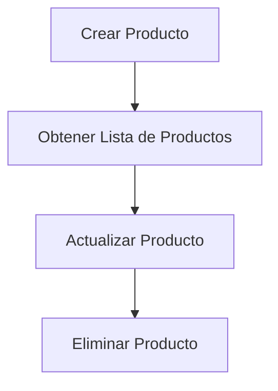
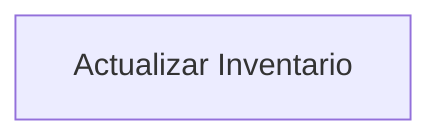
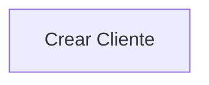
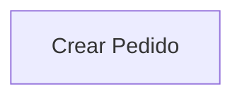
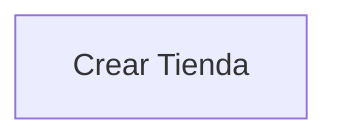

# Notas personales

- Registro de usuarios en DB con hash de password con bcrypt
- Creado token JWT en localStorage

- Falta verificar porque puedo entrar en endpoints sin el accessToken (Ejemplo: _/user/dashboard_)
- Verificar que el registro de usuarios se haga correctamente con bcrypt
- El token en localStorage tiene una expiración de 1h (_signOptions: { expiresIn: "1h" }_). Hay que verificar que despues de ese tiempo el token expira y se elimina

# Amazon AWS

- Crear instancia EC2 Ubuntu
- Conexión SSH: ssh -i /ruta/a/tu/archivo.pem ubuntu@tu-dns-publico-amazon:

```bash
  # Actualiza
  sudo apt update && sudo apt upgrade -y

  # Instala curl
  sudo apt install curl -y

  # Añade el repositorio de Node.js 18
  curl -fsSL https://deb.nodesource.com/setup_18.x | sudo -E bash -

  # Instala Node.js y NPM
  sudo apt install -y nodejs

  # Verifica la instalación
  node -v
  npm -v

  # Instala Git
  sudo apt install git -y

  # Clona tu repositorio
  git clone URL al Repo GitHub

  # Entra en la carpeta del proyecto
  cd Proyecto

  # Instala PM2 globalmente
  sudo npm install -g pm2

  # Configura PM2 para que se inicie con el sistema
  pm2 startup
  sudo env PATH=$PATH:/usr/bin pm2 startup systemd -u ubuntu --hp /home/ubuntu

  # Instala Nginx
  sudo apt install nginx -y

  # Inicia Nginx
  sudo systemctl start nginx

  # Habilita Nginx para que se inicie con el sistema
  sudo systemctl enable nginx

  # Construir el Front-End
  cd /home/ubuntu/SwiftShop/frontend
  npm install  # Instala las dependencias del frontend
  npm run build  # Genera los archivos estáticos de producción

  #Configura Nginx
  sudo nano /etc/nginx/sites-available/default

    server {
    listen 80;
    server_name tu-dominio-o-ip;  # Cambia esto por tu dominio o deja la IP pública de tu servidor EC2

    # Servir el frontend desde /home/ubuntu/SwiftShop/frontend/build o dist
    root /home/ubuntu/SwiftShop/frontend/dist;
    index index.html index.htm;

    location / {
        try_files $uri /index.html;  # Redirigir a index.html para que funcione el routing del frontend
    }

    # Configuración para el backend (API)
    location /api/ {
        proxy_pass http://localhost:3000;  # El backend de Node.js corriendo en el puerto 3000
        proxy_http_version 1.1;
        proxy_set_header Upgrade $http_upgrade;
        proxy_set_header Connection 'upgrade';
        proxy_set_header Host $host;
        proxy_cache_bypass $http_upgrade;
    }

    error_page 404 /404.html;
    location = /404.html {
        internal;
    }

    error_page 500 502 503 504 /50x.html;
    location = /50x.html {
        root /usr/share/nginx/html;
    }
}

  # Construir el Back-End
    # Entra en la carpeta de backend
    cd /home/ubuntu/SwiftShop/backend

    # Instala las dependencias de tu aplicación
    npm install

    # Ejecuta la aplicación usando PM2
    pm2 start npm --name "backend" -- start

    # Para verificar que PM2 esté corriendo
    pm2 list

  # Verifica que Nginx está bien configurado
  sudo nginx -t

  sudo chmod 755 /home/ubuntu
  sudo chmod 755 /home/ubuntu/SwiftShop
  sudo chmod 755 /home/ubuntu/SwiftShop/frontend
  sudo chmod 755 /home/ubuntu/SwiftShop/frontend/dist

  # Reiniciar Nginx
  sudo systemctl restart nginx
```

# WorkFlow de GitHub Actions

Por defecto en Ubuntu de EC2 no funciona, hay que seguir los siguientes pasos:

```bash
  sudo nano /etc/ssh/sshd_config
```

- Descomentar las siguientes líneas:

  - _PubkeyAuthentication yes_
  - _AuthorizedKeysFile .ssh/authorized_keys .ssh/authorized_keys2_

- Añadir la siguiente línea debajo de _PubkeyAuthentication yes_:
  - PubkeyAcceptedAlgorithms +ssh-rsa

# Información del Frontend

# Información del Backend

## Ejecutar la app

```bash
npm install --force
npm install -g @nestjs/cli
npm install dotenv --force
npm install @nestjs/config --force
npm install @types/node --save-dev --force

-- npm install @nestjs/common@^8.0.0 @nestjs/core@^8.0.0 @nestjs/swagger@^5.0.0

npm install @nestjs/typeorm typeorm mysql2 --force
npm init
npm start
# (Se ejecuta en http://localhost:3000/api/)
```

## Documentación de la API REST

## Endpoints

### Productos

#### Crear un Producto

- **URL**: `/api/products`
- **Método**: `POST`
- **Descripción**: Crea un nuevo producto.
- **Request Body**:

```json
{
  "name": "Nombre del Producto",
  "description": "Descripción del Producto",
  "price": 100.0,
  "stock": 50,
  "category": "Categoría del Producto"
}
```

- **Response**:

```json
{
  "id": 1,
  "name": "Nombre del Producto",
  "description": "Descripción del Producto",
  "price": 100.0,
  "stock": 50,
  "category": "Categoría del Producto",
  "createdAt": "2024-06-01T00:00:00Z"
}
```

#### Obtener Lista de Productos

- **URL**: `/api/products`
- **Método**: `GET`
- **Descripción**: Obtiene una lista de todos los productos.
- **Response**:

```json
[
	{
		"id": 1,
		"name": "Nombre del Producto",
		"description": "Descripción del Producto",
		"price": 100.00,
		"stock": 50,
		"category": "Categoría del Producto",
		"createdAt": "2024-06-01T00:00:00Z"
	},
	...
]
```

#### Actualizar un Producto

- **URL**: `/api/products/{id}`
- **Método**: `PUT`
- **Descripción**: Actualiza la información de un producto existente.
- **Request Body**:

```json
{
  "name": "Nombre del Producto Actualizado",
  "description": "Descripción del Producto Actualizada",
  "price": 120.0,
  "stock": 60,
  "category": "Nueva Categoría"
}
```

- **Response**:

```json
{
  "id": 1,
  "name": "Nombre del Producto Actualizado",
  "description": "Descripción del Producto Actualizada",
  "price": 120.0,
  "stock": 60,
  "category": "Nueva Categoría",
  "updatedAt": "2024-06-01T01:00:00Z"
}
```

#### Eliminar un Producto

- **URL**: `/api/products/{id}`
- **Método**: `DELETE`
- **Descripción**: Elimina un producto existente.
- **Response**:

```json
{
  "message": "Producto eliminado exitosamente."
}
```

### Inventario

#### Actualizar Inventario

- **URL**: `/api/inventory`
- **Método**: `PUT`
- **Descripción**: Actualiza la cantidad de inventario de un producto.
- **Request Body**:

```json
{
  "productId": 1,
  "quantity": 100
}
```

- **Response**:

```json
{
  "productId": 1,
  "quantity": 100,
  "updatedAt": "2024-06-01T01:30:00Z"
}
```

### Clientes

#### Crear un Cliente

- **URL**: `/api/customers`
- **Método**: `POST`
- **Descripción**: Crea un nuevo cliente.
- **Request Body**:

```json
{
  "name": "Nombre del Cliente",
  "email": "cliente@example.com",
  "address": "Dirección del Cliente"
}
```

- **Response**:

```json
{
  "id": 1,
  "name": "Nombre del Cliente",
  "email": "cliente@example.com",
  "address": "Dirección del Cliente",
  "createdAt": "2024-06-01T02:00:00Z"
}
```

### Pedidos

#### Crear un Pedido

- **URL**: `/api/orders`
- **Método**: `POST`
- **Descripción**: Crea un nuevo pedido.
- **Request Body**:

```json
{
  "customerId": 1,
  "products": [
    {
      "productId": 1,
      "quantity": 2
    },
    {
      "productId": 2,
      "quantity": 1
    }
  ],
  "total": 300.0
}
```

- **Response**:

```json
{
  "id": 1,
  "customerId": 1,
  "products": [
    {
      "productId": 1,
      "quantity": 2
    },
    {
      "productId": 2,
      "quantity": 1
    }
  ],
  "total": 300.0,
  "createdAt": "2024-06-01T03:00:00Z"
}
```

### Usuarios/Tiendas

#### Crear una Tienda

- **URL**: `/api/stores`
- **Método**: `POST`
- **Descripción**: Crea una nueva tienda.
- **Request Body**:

```json
{
  "name": "Nombre de la Tienda",
  "ownerId": 1
}
```

- **Response**:

```json
{
  "id": 1,
  "name": "Nombre de la Tienda",
  "ownerId": 1,
  "createdAt": "2024-06-01T04:00:00Z"
}
```

## Diagramas de Flujos

### Flujo de Productos



### Flujo de Inventario



### Flujo de Clientes



### Flujo de Pedidos



### Flujo de Usuarios/Tiendas


